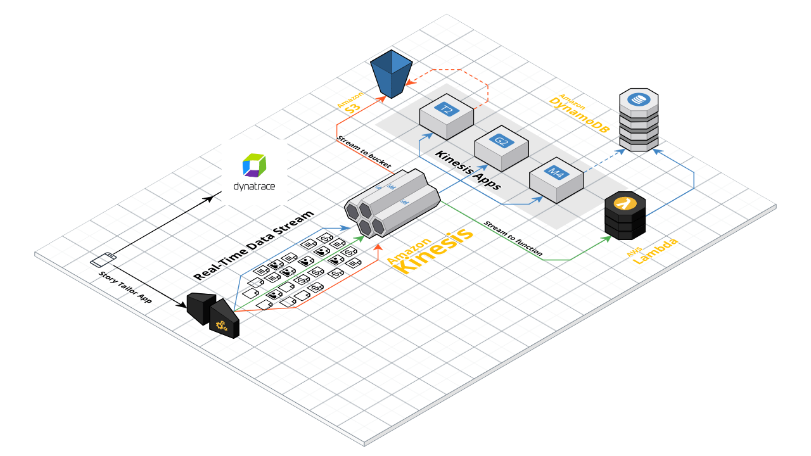

# Story-Tailor 🪡


> ".........StoryTailor is a mobile app that allows users to personalize books, making them more relatable and engaging.  Monitoring and Observability is provided by Dynatrace"


This is an [Expo](https://expo.dev) project created with [`create-expo-app`](https://www.npmjs.com/package/create-expo-app).


## "Advanced" User Installation Summary

` git clone `

` npm install `

` npx expo run:ios `

## Get started with your own Fork  ⑂

1. Install dependencies

   ```bash
   npm install
   ```

2. Start the app

   ```bash
    npx expo start
   ```

In the output, you'll find options to open the app in a

- [development build](https://docs.expo.dev/develop/development-builds/introduction/)
- [Android emulator](https://docs.expo.dev/workflow/android-studio-emulator/)
- [iOS simulator](https://docs.expo.dev/workflow/ios-simulator/)
- [Expo Go](https://expo.dev/go), a limited sandbox for trying out app development with Expo

You can start developing by editing the files inside the **app** directory. This project uses [file-based routing](https://docs.expo.dev/router/introduction).


## Features

* [React Native](https://reactnative.dev) Framework
* [Dynatrace](https://dynatrace.com) Monitoring
* Generative AI personalization
* ...and more! 





[https://app.cloudcraft.co/view/7a37c888-2ccd-4dc4-b6a6-07d912c0cac9?key=3m40jn0enpfd2t90
](https://app.cloudcraft.co/view/7a37c888-2ccd-4dc4-b6a6-07d912c0cac9?key=3m40jn0enpfd2t90)

